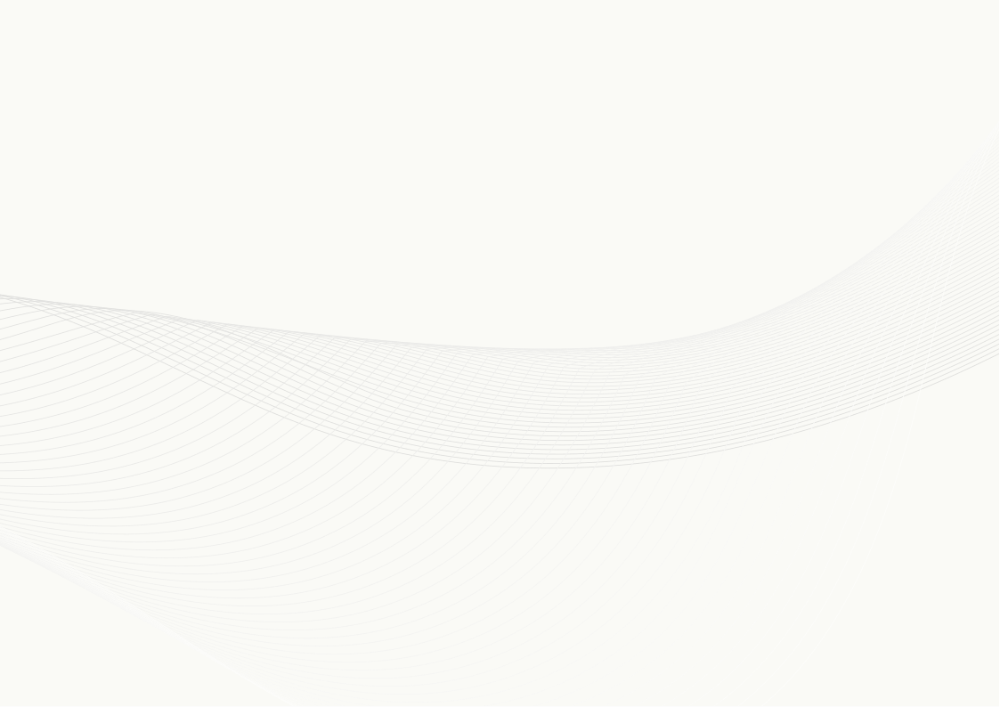
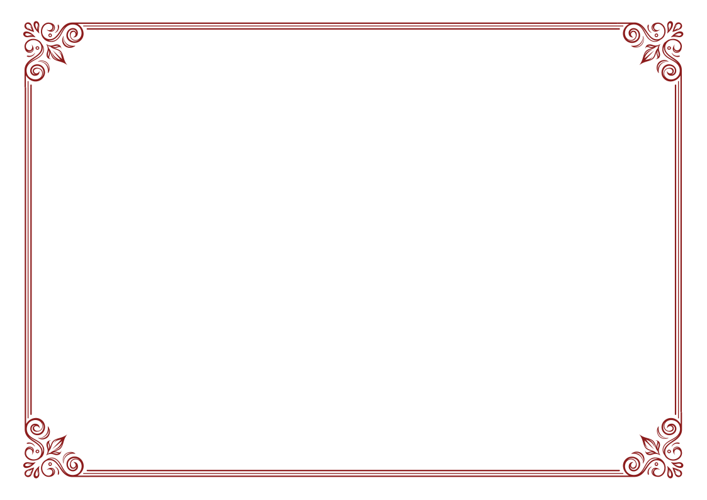
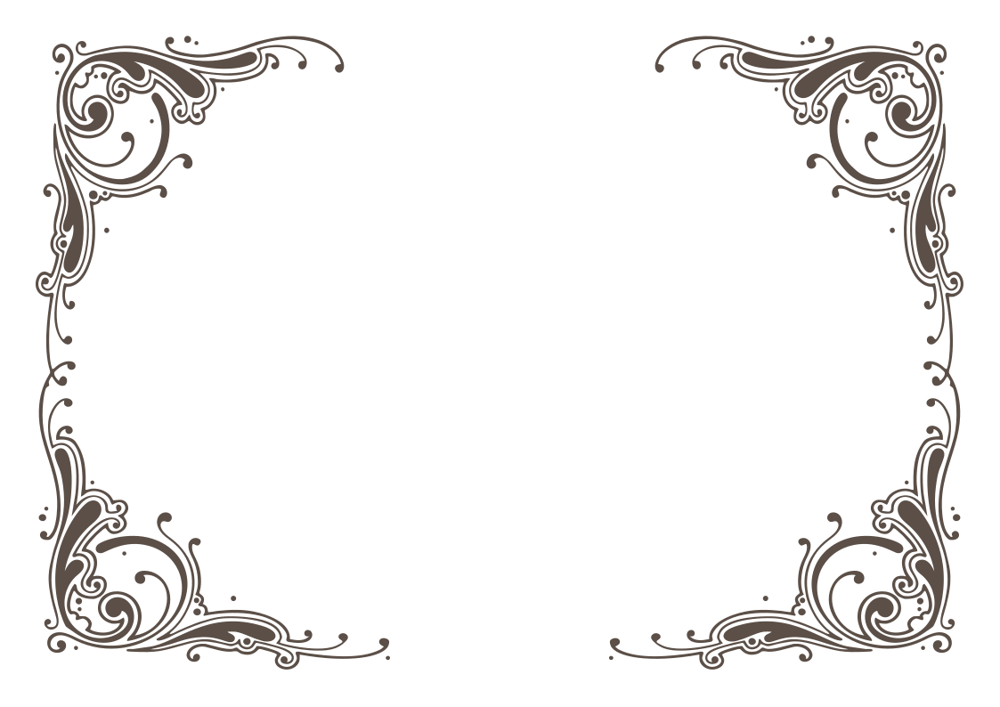
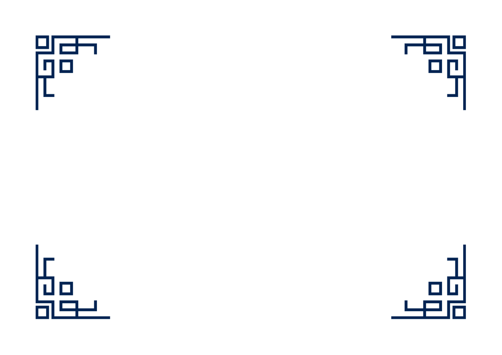
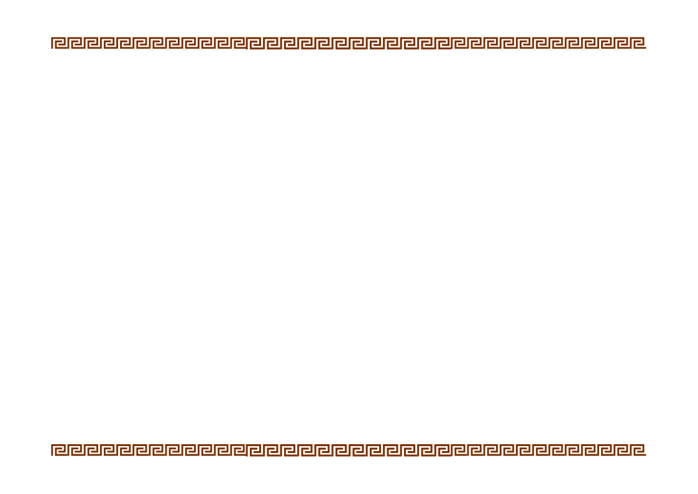
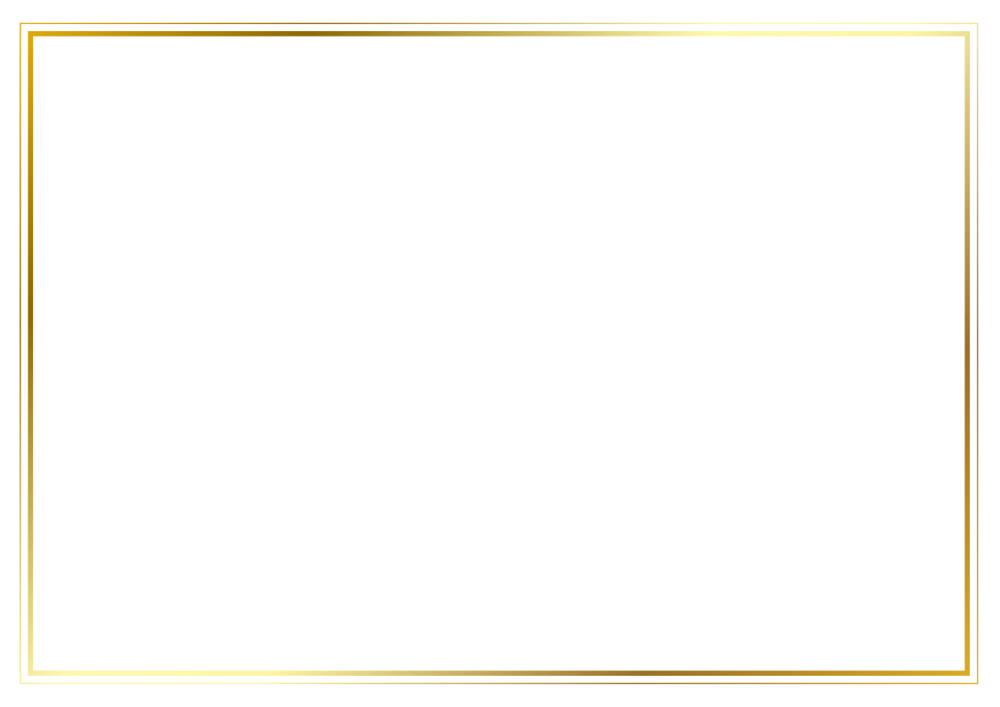
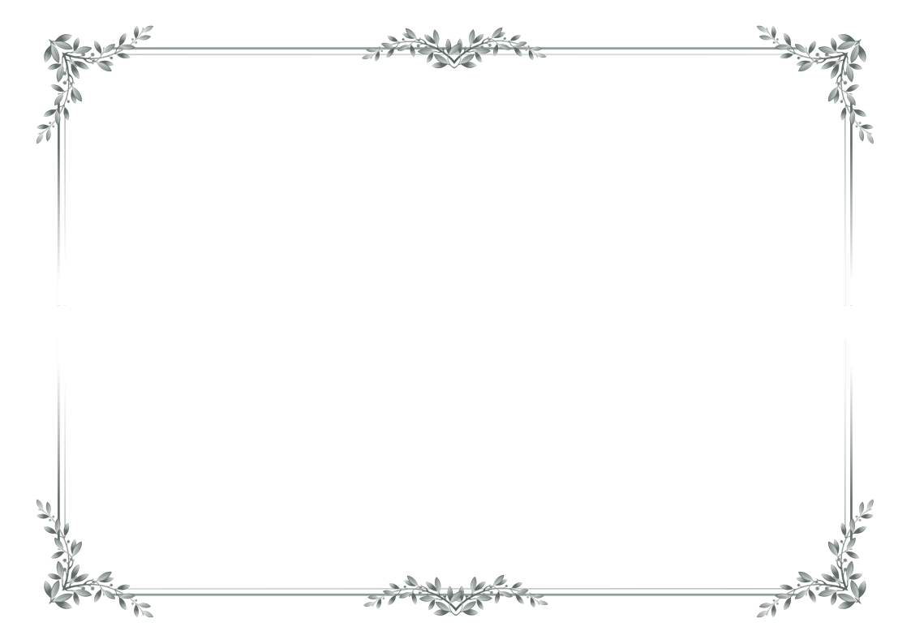

# ConferCraft

**Open-source tools for academic congress workflows.**

ConferCraft is an open-source project focused on creating practical, browser-based tools for academic conferences, congresses, symposia, and similar scientific events.

The project currently includes a central **ConferCraft Home** interface and two document-generation applications:

- **Acceptance Letter Generator** — create personalized congress acceptance letters in bulk.
- **Certificate Generator** — create personalized one-page certificates in bulk.

All applications run directly in the browser. Users do not need to install R, RStudio, or any additional software to use the live versions.

## Live Applications

### ConferCraft Home

**[Open ConferCraft](https://gungormetehan-confercraft.share.connect.posit.cloud/)**

The ConferCraft Home application is the main entry point for the project. It provides a clean interface for accessing the available tools and keeps the applications connected as part of a single workflow.

### Acceptance Letter Generator

**[Launch the Acceptance Letter Generator](https://gungormetehan-acceptance-letter-generator.share.connect.posit.cloud/)**

Create, preview, customize, and export personalized academic acceptance letters from an Excel participant list.

### Certificate Generator

**[Launch the Certificate Generator](https://gungormetehan-certificate-generator.share.connect.posit.cloud/)**

Create, preview, customize, and export personalized landscape certificates from an Excel participant list.

---

# Acceptance Letter Generator

## What It Does

Acceptance Letter Generator helps congress organizers create personalized acceptance letters in bulk.

Upload an Excel file containing participant information, customize the letter design and content, preview participant-specific PDFs, and export all generated letters as a ZIP file.

### Main Features

- Excel-based batch letter generation
- Personalized participant names and paper titles
- Eight customizable PDF templates
- Single-color template customization
- Open-source font collection
- Support for Turkish characters
- Separate fonts for title/branding and body/signature text
- Markdown-style bold and italic formatting
- LaTeX-style mathematical expressions
- Optional congress or organization branding
- Optional congress logo
- One, two, or three signature blocks
- Optional signature images
- Optional Excel-based footer text
- Participant-specific PDF preview
- Preview update workflow
- Batch PDF export as ZIP
- Light and dark interface modes
- A4 portrait PDF output
- Direct navigation to Certificate Generator
- Clickable ConferCraft brand link back to the main application

## Acceptance Letter Templates

The Acceptance Letter Generator currently includes eight templates:

<table>
  <tr>
    <td align="center">
      <br>
      <b>Linear Horizon</b>
    </td>
    <td align="center">
      <br>
      <b>Contour Flow</b>
    </td>
    <td align="center">
      <br>
      <b>Diamond Edge</b>
    </td>
    <td align="center">
      <br>
      <b>Watercolor Bloom</b>
    </td>
  </tr>
  <tr>
    <td align="center">
      <br>
      <b>Canvas Wash</b>
    </td>
    <td align="center">
      <br>
      <b>Silken Waves</b>
    </td>
    <td align="center">
      <br>
      <b>Prism Dots</b>
    </td>
    <td align="center">
      <br>
      <b>Origami Fold</b>
    </td>
  </tr>
</table>

Each template can be recolored using a single **Template Color** setting while preserving the template's light and dark visual hierarchy.

## Acceptance Letter Excel File Format

The uploaded Excel file should contain participant information in the first columns.

| Column | Content                | Required |
|--------|------------------------|----------|
| 1      | Full Name              | Yes      |
| 2      | Paper Title            | Yes      |
| 3      | Footer Text (Optional) | No       |

Example:

| Full Name      | Paper Title                                                                                          | Footer |
|----------------|------------------------------------------------------------------------------------------------------|--------|
| Cameron Tucker | Machine Learning-Based Prediction of Academic Performance Using Multidimensional Learning Indicators | MF2009 |
| Michael Scott  | Explainable Artificial Intelligence for Automated Assessment of Psychological Constructs             | TO2005 |
| Ron Swanson    | Evaluating Measurement Invariance in AI-Assisted Psychometric Assessment Systems                     | PR2009 |

The third column is optional. If it contains text, that text is displayed as a small gray footer in the generated PDF.

## Acceptance Letter Personalization

The letter content supports placeholders:

```text
{name}
```

Participant's full name from the first Excel column.

```text
{paper}
```

Paper title from the second Excel column.

Example:

```text
Dear {name},

We are pleased to inform you that your paper entitled "{paper}"
has been accepted for presentation at our congress.
```

## Rich Text and Mathematical Expressions

Acceptance Letter Generator supports lightweight Markdown-style formatting:

```text
**bold**
*italic*
***bold italic***
```

Inline and block-style mathematical expressions can also be used with LaTeX-style syntax.

```text
$E = mc^2$
```

```text
$$
x = \frac{-b \pm \sqrt{b^2 - 4ac}}{2a}
$$
```

## Acceptance Letter Branding

Congress branding is optional.

Users can add:

- Congress or organization name
- Congress logo
- Signature text
- Signature images

The application supports up to three signature blocks.

---

# Certificate Generator

## What It Does

Certificate Generator helps congress organizers create personalized certificates in bulk from an Excel participant list.

Each participant receives a single-page landscape PDF certificate. Users can customize the certificate title, body, template, color, fonts, logos, signatures, and participant name size before exporting all certificates as a ZIP file.

### Main Features

- Excel-based batch certificate generation
- Required Full Name column and optional Title column
- `{name}` and `{title}` placeholders
- Independently adjustable `{name}` font size
- Eight customizable SVG certificate templates
- Single-color template customization
- Separate title and body/signature font controls
- Markdown-style bold and italic formatting
- Up to two logos
- Independent logo placement
- Six logo positions: Top Left, Top Center, Top Right, Bottom Left, Bottom Center, Bottom Right
- Up to two signatures
- Independent signature placement
- Three signature positions: Bottom Left, Bottom Center, Bottom Right
- Position conflict validation for logos and signatures
- Participant-specific PDF preview
- Preview update workflow
- Batch PDF export as ZIP
- Light and dark interface modes
- One-page landscape PDF output
- Direct navigation to Acceptance Letter Generator
- Clickable ConferCraft brand link back to the main application

## Certificate Templates

The Certificate Generator currently includes eight templates:

<table>
  <tr>
    <td align="center">
      <br>
      <b>Whisper Current</b>
    </td>
    <td align="center">
      <br>
      <b>Classic Flourish</b>
    </td>
    <td align="center">
      <br>
      <b>Baroque Scroll</b>
    </td>
    <td align="center">
      <br>
      <b>Deco Grid</b>
    </td>
  </tr>
  <tr>
    <td align="center">
      <br>
      <b>Hellenic Key</b>
    </td>
    <td align="center">
      <br>
      <b>Laureate Crest</b>
    </td>
    <td align="center">
      <br>
      <b>Fine Line</b>
    </td>
    <td align="center">
      <br>
      <b>Botanical Filigree</b>
    </td>
  </tr>
</table>

Each certificate template can be recolored using a single **Template Color** setting while preserving the source artwork's visual hierarchy.

## Certificate Excel File Format

The uploaded Excel file should contain participant information in the first two columns.

| Column | Content   | Required |
|--------|-----------|----------|
| 1      | Full Name | Yes      |
| 2      | Title     | No       |

Example:

| Full Name      | Title                       |
|----------------|-----------------------------|
| Cameron Tucker | Invited Speaker             |
| Michael Scott  | Scientific Committee Member |
| Ron Swanson    | Session Chair               |

The second column is optional. It is only required when the certificate content uses the `{title}` placeholder.

## Certificate Personalization

Certificate title and body text support:

```text
{name}
```

Participant's full name from the first Excel column.

```text
{title}
```

Participant's optional title or role from the second Excel column.

Example:

```text
This certificate is proudly presented to

{name}

for their contribution as **{title}** to the scientific program of the event.
```

The font size of `{name}` can be adjusted independently from the surrounding certificate text.

## Logos and Signatures

Certificate Generator supports up to two logos and two signature blocks.

Logo positions:

- Top Left
- Top Center
- Top Right
- Bottom Left
- Bottom Center
- Bottom Right

Signature positions:

- Bottom Left
- Bottom Center
- Bottom Right

Two logos cannot occupy the same slot. Two signatures cannot occupy the same slot, and a bottom-positioned logo cannot share the same slot as a signature.

---

# ConferCraft Home

The **ConferCraft Home** application acts as the central entry point for the project.

It provides:

- A unified landing page for the ConferCraft tool family
- Direct access to Acceptance Letter Generator
- Direct access to Certificate Generator
- Shared visual language with the document-generation applications
- Light and dark interface modes
- Responsive desktop and mobile layout
- Direct GitHub access

The two generators also contain navigation controls for moving between applications, while the ConferCraft brand link returns users to the main landing page.

---

# Fonts and Interface

ConferCraft uses a consistent visual system across its applications.

The interface uses:

- **IBM Plex Sans** for controls, helper text, menus, and general interface content
- **DM Serif Display** for editorial-style headings and branding
- A teal-centered color palette
- Light and dark appearance modes
- Rounded cards, subtle gradients, and restrained interface decoration

The PDF generators use an open-source font workflow designed to work reliably in local and cloud deployments.

The font menus include families suitable for Turkish characters such as:

`ç, ğ, ı, İ, ö, ş, ü`

Where supported, title and body/signature fonts can be selected independently.

# Project Structure

ConferCraft is organized as a multi-application repository.

```text
ConferCraft/
├── README.md
├── LICENSE
├── .gitignore
└── apps/
    ├── confercraft/
    │   ├── app.R
    │   └── manifest.json
    │
    ├── acceptance-letter-generator/
    │   ├── app.R
    │   ├── manifest.json
    │   └── templates/
    │       ├── linear_horizon.svg
    │       ├── contour_flow.svg
    │       ├── diamond_edge.svg
    │       ├── watercolor_bloom.svg
    │       ├── canvas_wash.svg
    │       ├── silken_waves.svg
    │       ├── prism_dots.svg
    │       └── origami_fold.svg
    │
    └── certificate-generator/
        ├── app.R
        ├── manifest.json
        └── templates/
            ├── whisper_current.svg
            ├── classic_flourish.svg
            ├── baroque_scroll.svg
            ├── deco_grid.svg
            ├── hellenic_key.svg
            ├── laureate_crest.svg
            ├── fine_line.svg
            └── botanical_filigree.svg
```

Future ConferCraft tools can be added as separate folders under `apps/` while keeping the same shared product structure.

# Running Locally

## Requirements

Install R and the packages required by the application you want to run.

### ConferCraft Home

```r
shiny
```

### Acceptance Letter Generator

Core packages include:

```r
shiny
readxl
zip
grid
png
jpeg
sysfonts
showtext
```

The application can also use packages such as `rsvg`, `magick`, and `latex2exp` for SVG rendering and mathematical expressions.

### Certificate Generator

Core packages include:

```r
shiny
readxl
zip
grid
png
jpeg
sysfonts
showtext
rsvg
```

## Start an Application

Open the relevant application directory in R/RStudio and run:

```r
shiny::runApp()
```

For example:

```r
shiny::runApp("apps/confercraft")
shiny::runApp("apps/acceptance-letter-generator")
shiny::runApp("apps/certificate-generator")
```

You can also open the corresponding `app.R` file in RStudio and click **Run App**.

# Deployment

The live ConferCraft applications are deployed using **Posit Connect Cloud**.

The source code is maintained on GitHub, while Connect Cloud runs each Shiny application as a separate deployed content item.

Deployment manifests are stored in:

```text
apps/confercraft/manifest.json
apps/acceptance-letter-generator/manifest.json
apps/certificate-generator/manifest.json
```

The applications can use environment variables for cross-application navigation:

```text
CONFERCRAFT_HOME_URL
CONFERCRAFT_ACCEPTANCE_URL
CONFERCRAFT_CERTIFICATE_URL
```

# Open Source

ConferCraft is an open-source project.

You are welcome to inspect the source code, learn from it, adapt it, and contribute improvements in accordance with the repository license.

# Roadmap

Current ConferCraft applications:

- ✅ ConferCraft Home
- ✅ Acceptance Letter Generator
- ✅ Certificate Generator

Future versions may add additional tools for academic event and congress workflows.

# License

This project is licensed under the **MIT License**.

See the [`LICENSE`](https://github.com/gungorMetehan/ConferCraft/blob/main/LICENSE) file for details.

# Author

**Metehan Güngör**

GitHub: [@gungorMetehan](https://github.com/gungorMetehan)

---

### ConferCraft

*Build professional congress documents with less repetitive work.*
