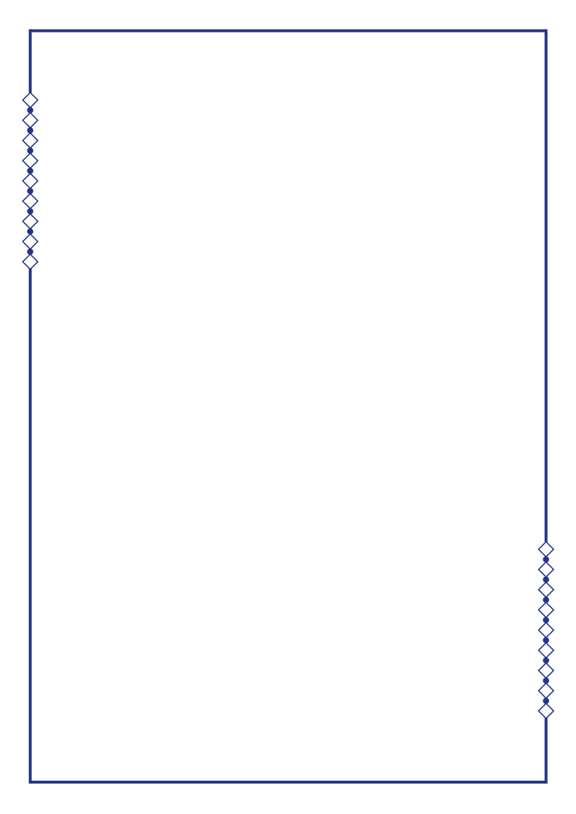

# ConferCraft

**Open-source tools for academic congress workflows.**

ConferCraft is an open-source project focused on creating practical, browser-based tools for academic conferences, congresses, symposia, and similar scientific events.

The first application in the ConferCraft project is the **Acceptance Letter Generator**, a Shiny web application for producing personalized congress acceptance letters from an Excel participant list.

## Acceptance Letter Generator

### Live Application

**[Launch the Acceptance Letter Generator](https://gungormetehan-acceptance-letter-generator.share.connect.posit.cloud/)**

The application runs directly in the browser. Users do not need to install R, RStudio, or any additional software.

## What It Does

Acceptance Letter Generator helps congress organizers create personalized acceptance letters in bulk.

Upload an Excel file containing participant information, customize the letter design and content, preview the generated PDF, and export all letters as a ZIP file.

### Main Features

- Excel-based batch letter generation
- Personalized participant names and paper titles
- Eight customizable PDF templates
- Single-color template customization
- Open-source font collection
- Support for Turkish characters
- Separate fonts for title/branding and body/signature text
- Markdown-style bold and italic formatting
- LaTeX-style mathematical expressions
- Optional congress or organization branding
- Optional congress logo
- One, two, or three signature blocks
- Optional signature images
- Optional Excel-based footer text
- Participant-specific PDF preview
- Preview update workflow
- Batch PDF export as ZIP
- Light and dark interface modes
- A4 portrait PDF output

## Templates

The application currently includes eight templates:

<table>
  <tr>
    <td align="center">
      <br>
      <b>Linear Horizon</b>
    </td>
    <td align="center">
      <br>
      <b>Contour Flow</b>
    </td>
    <td align="center">
      <br>
      <b>Diamond Edge</b>
    </td>
    <td align="center">
      <br>
      <b>Watercolor Bloom</b>
    </td>
  </tr>
  <tr>
    <td align="center">
      <br>
      <b>Canvas Wash</b>
    </td>
    <td align="center">
      <br>
      <b>Silken Waves</b>
    </td>
    <td align="center">
      <br>
      <b>Prism Dots</b>
    </td>
    <td align="center">
      <br>
      <b>Origami Fold</b>
    </td>
  </tr>
</table>

Each template can be recolored using a single **Template Color** setting while preserving the template's light and dark visual hierarchy.

## Excel File Format

The uploaded Excel file should contain participant information in the first columns.

| Column | Content                | Required |
|--------|------------------------|----------|
| 1      | Full Name              | Yes      |
| 2      | Paper Title            | Yes      |
| 3      | Footer Text (Optional) | No       |

Example:

| Full Name      | Paper Title                                                                                          | Footer |
|----------------|------------------------------------------------------------------------------------------------------|--------|
| Cameron Tucker | Machine Learning-Based Prediction of Academic Performance Using Multidimensional Learning Indicators | MF2009 |
| Michael Scott  | Explainable Artificial Intelligence for Automated Assessment of Psychological Constructs             | TO2005 |
| Ron Swanson    | Evaluating Measurement Invariance in AI-Assisted Psychometric Assessment Systems                     | PR2009 |

The third column is optional. If it contains text, that text is displayed as a small gray footer in the generated PDF.

## Personalization

The body text supports placeholders:

```text
{name}
```

Participant's full name from the first Excel column.

```text
{paper}
```

Paper title from the second Excel column.

Example:

```text
Dear {name},

We are pleased to inform you that your paper entitled "{paper}"
has been accepted for presentation at our congress.
```

## Rich Text and Mathematical Expressions

Letter content supports lightweight Markdown-style formatting.

```text
**bold**
*italic*
***bold italic***
```

Inline and block-style mathematical expressions can also be used with LaTeX-style syntax.

```text
$E = mc^2$
```

```text
$$
x = \frac{-b \pm \sqrt{b^2 - 4ac}}{2a}
$$
```

## Branding

Congress branding is optional.

Users can add:

- Congress or organization name
- Congress logo
- Signature text
- Signature images

The application supports up to three signature blocks.

## Fonts

ConferCraft uses an open-source font workflow designed to work reliably in local and cloud deployments.

The font menu contains a broad selection of open fonts, including families suitable for Turkish characters such as:

`ç, ğ, ı, İ, ö, ş, ü`

Title/branding and body/signature fonts can be selected independently.

## Project Structure

ConferCraft is designed as a multi-application repository.

```text
ConferCraft/
├── README.md
├── LICENSE
├── .gitignore
└── apps/
    └── acceptance-letter-generator/
        ├── app.R
        ├── manifest.json
        └── templates/
            ├── linear_horizon.svg
            ├── contour_flow.svg
            ├── diamond_edge.svg
            ├── watercolor_bloom.svg
            ├── canvas_wash.svg
            ├── silken_waves.svg
            ├── prism_dots.svg
            └── origami_fold.svg
```

Future ConferCraft applications can be added as separate folders under `apps/`.

For example:

```text
apps/
├── acceptance-letter-generator/
└── certificate-generator/
```

## Running Locally

### Requirements

Install R and the required R packages.

The application uses packages including:

```r
shiny
readxl
zip
grid
png
jpeg
sysfonts
showtext
```

It can also use packages such as `rsvg`, `magick`, and `latex2exp` for SVG rendering and mathematical expressions.

### Start the Application

Open the Acceptance Letter Generator directory in R/RStudio and run:

```r
shiny::runApp()
```

or open `app.R` in RStudio and click **Run App**.

## Deployment

The live application is deployed using **Posit Connect Cloud**.

The application source code is maintained on GitHub, while Connect Cloud runs the Shiny application and provides the public web interface.

The deployment configuration for the Acceptance Letter Generator is stored in:

```text
apps/acceptance-letter-generator/manifest.json
```

## Open Source

ConferCraft is an open-source project.

You are welcome to inspect the source code, learn from it, adapt it, and contribute improvements in accordance with the repository license.

## Roadmap

ConferCraft is intended to grow into a collection of tools for academic event workflows.

Current and planned tools include:

- ✅ Acceptance Letter Generator
- 🚧 Certificate Generator
- More congress workflow tools in the future

## License

This project is licensed under the **MIT License**.

See the [`LICENSE`](https://github.com/gungorMetehan/ConferCraft/blob/main/LICENSE) file for details.

## Author

**Metehan Güngör**

GitHub: [@gungorMetehan](https://github.com/gungorMetehan)

---

### ConferCraft

*Build professional congress documents with less repetitive work.*
